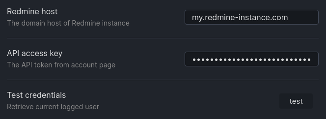
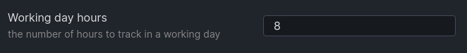
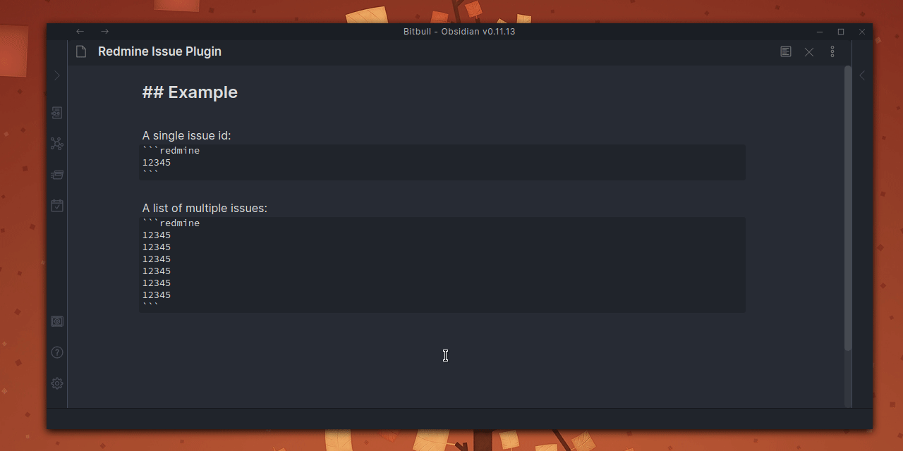
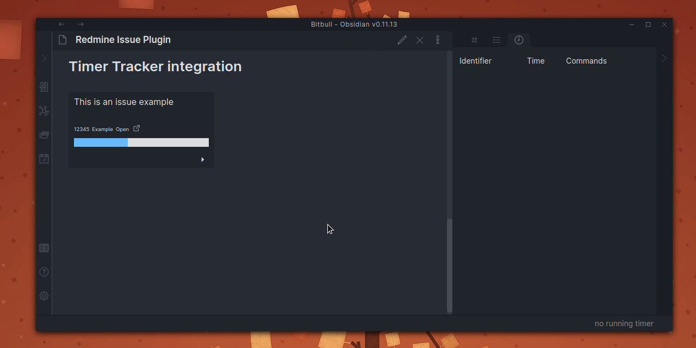
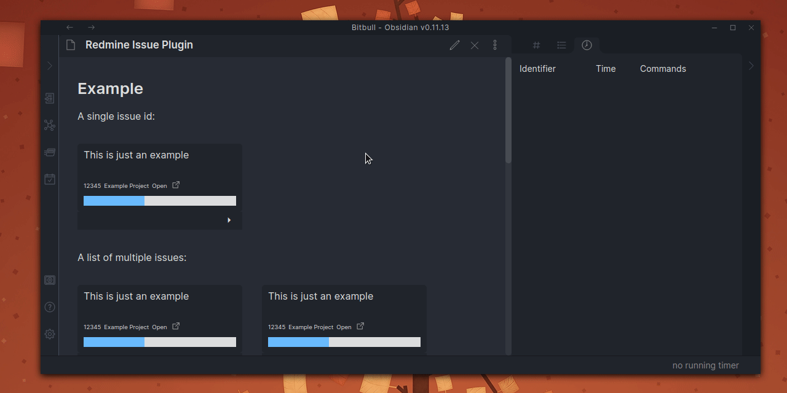

# Obsidian Redmine Issue Plugin

An [Obsidian.md](https://obsidian.md/) plugin that show Redmine issue details.

## Requirements

- A Redmine instance endpoint
- A personal API access key (My account > API access key > Show)

## Installation

Download zip archive from [GitHub releases page](https://github.com/daaru00/obsidian-redmine-issue/releases) and extract it into `<vault>/.obsidian/plugins` directory.

## Configurations

In order to show issues details the plugin need to be configured with `host` and `API access key` configuration.



The total working day hours can be set with the appropriate configuration. 



## Usage

Add this code block where you want to show the issue widget:
````makrdown
```redmine
12345
```
````

or add multiple ids, one for each line, to show a grid of widgets:
````makrdown
```jira
12345
12346
12347
12348
12349
12340
```
````

Open the preview mode to see issue's details:



## Usage with Time Tracker

This plugin is compatible with [Time Tracker Plugin](https://github.com/daaru00/obsidian-timer-tracker), you can start a timer and save it as Redmine Time Entry:



An additional panel can be activated in order to show the percentage of worked hours are being currently saved to Redmine:


